<div align="center">


</div>

<div align="center">


</div>

<br/>

<div align="center">


</div>

---

<div align="center">

```
Android 개발자로 시작해 AI · LLM으로 전향 중인 개발자입니다.
아이디어를 실제 서비스로 구현하는 것을 좋아하고,
창업동아리 팀장으로 18건의 경진대회 수상 경험을 쌓았습니다.
현재 SK Networks Family AI Camp 27기에서 LLM · Multi-Agent를 깊게 파고 있습니다.
```

</div>

---

## 🧠 AI / LLM Stack

<div align="center">


</div>

---

## 🛠 Full Stack

<details>
<summary><b>📱 Frontend / Mobile</b></summary>
<br/>


</details>

<details>
<summary><b>🔧 Backend / Database</b></summary>
<br/>


</details>

<details>
<summary><b>🚀 Cloud / Deployment</b></summary>
<br/>


</details>

---

## 📖 Currently Deep-Diving

```python
current_focus = {
    "LLM"      : ["Multi-Agent 설계", "MCP 기반 에이전트 협업", "RAG 고도화"],
    "ML"       : ["모델 평가 지표", "파인튜닝", "피처 엔지니어링"],
    "Camp"     : "SK Networks Family AI Camp 27th 🔥",
    "goal"     : "LLM Engineer @ AI-first company"
}
```

---

## 🏆 수상 하이라이트

| 연도 | 대회 | 수상 | 주관 |
|:---:|:---|:---:|:---:|
| 2025 | 인력양성 성과공유회 캡스톤디자인 | 실용가치상 | 목원대학교 |
| 2024 | 진로 포트폴리오 경진대회 | **최우수상 🥇** | 목원대학교 |
| 2024 | 스타트업 코리아 투자위크 모의 IR | **우수상** | 중소벤처기업부·대전광역시 |
| 2024 | 글로벌 스타트업스쿨 캠프 | **Leadership상** | 한남대학교 |
| 2024 | 모빌리티 드론코딩 경진대회 | **최우수상 🥇** | 목원대학교 |
| 2024 | 산학협력 캡스톤디자인 논문 경진대회 | **우수상** | 한국콘텐츠학회 |
| 2023 | 캡스톤디자인 내부경진대회 | **최우수상 🥇** | 목원대학교 |
| 2023 | 대전 스타트업 스쿨 | **우수상** | 대전창조경제혁신센터 |

> 교내외 경진대회 누적 **18관왕** 🏅

---

## 🚀 Projects

### 🤖 AI / LLM
| 프로젝트 | 설명 | 스택 |
|:---|:---|:---|
| SK AI Camp 최종 프로젝트 | 다중 에이전트 기반 업무자동화 시스템 | LangGraph · MCP · RAG |

### 📱 Android / Mobile
| 프로젝트 | 설명 | 스택 |
|:---|:---|:---|
| [Collobo Station](https://github.com/EJ-pro/Collobo-Station) | 개발자·디자이너 협업 매칭 플랫폼 | Kotlin · Firebase · Android |
| [Smart Pot](https://github.com/EJ-pro/smartpot) | 스마트 화분 IoT 모니터링 앱 | Java · Firebase · IoT |

---

## 📊 GitHub Stats

<div align="center">
  <br/><br/>
  
</div>

---

## 🏆 GitHub Trophies

<div align="center">
  
</div>

---

## 📬 Contact

<div align="center">

<a href="https://ejpro.tistory.com/">
  
</a>
&nbsp;
<a href="mailto:hsshss2522@naver.com">
  
</a>
<br/>

---

<div align="center">

*"동작하는 것보다, 잘 동작하는 것을. 잘 동작하는 것보다, 의미 있는 것을."*


</div>
